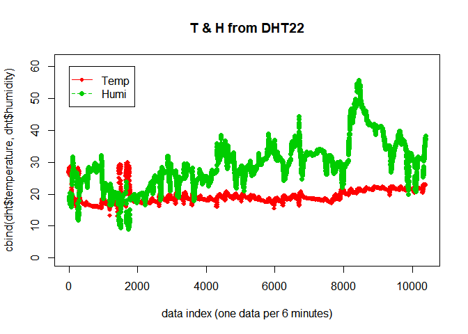

# rmd2github
Redwoods  
2017년 4월 22일  


## Load data from a json file


```r
library(jsonlite)
dht <- fromJSON("DHT22_170303_6weeks.json", flatten=TRUE)
```

## Check data


```r
summary(dht)
```

```
##      date           temperature          humidity        
##  Length:10386       Length:10386       Length:10386      
##  Class :character   Class :character   Class :character  
##  Mode  :character   Mode  :character   Mode  :character  
##                                                          
##                                                          
##                                                          
##      _id                 __v   
##  Length:10386       Min.   :0  
##  Class :character   1st Qu.:0  
##  Mode  :character   Median :0  
##                     Mean   :0  
##                     3rd Qu.:0  
##                     Max.   :0
```

```r
str(dht)
```

```
## 'data.frame':	10386 obs. of  5 variables:
##  $ date       : chr  "2017-03-02 09:07:51.336" "2017-03-02 09:13:51.603" "2017-03-02 09:19:51.854" "2017-03-02 09:25:52.105" ...
##  $ temperature: chr  "26.9" "27.2" "27.2" "27.2" ...
##  $ humidity   : chr  "18.6" "18.5" "18.6" "18.6" ...
##  $ _id        : chr  "58b76257b0c8c8f802a3e341" "58b763bfb0c8c8f802a3e342" "58b76527b0c8c8f802a3e343" "58b76690b0c8c8f802a3e344" ...
##  $ __v        : int  0 0 0 0 0 0 0 0 0 0 ...
```

## Plot data


```r
par(mfrow=c(1,1))
matplot(cbind(dht$temperature,dht$humidity), ylim=c(0,1.1*max(as.numeric(dht$temperature),as.numeric(dht$humidity))), pch = 18:19, col=2:3, xlab = "data index (one data per 6 minutes)", main = "T & H from DHT22")
legend(1,60,c("Temp", "Humi"), pch = c(18,19), col=c(2,3), lty = c(1,2))
```

<!-- -->
